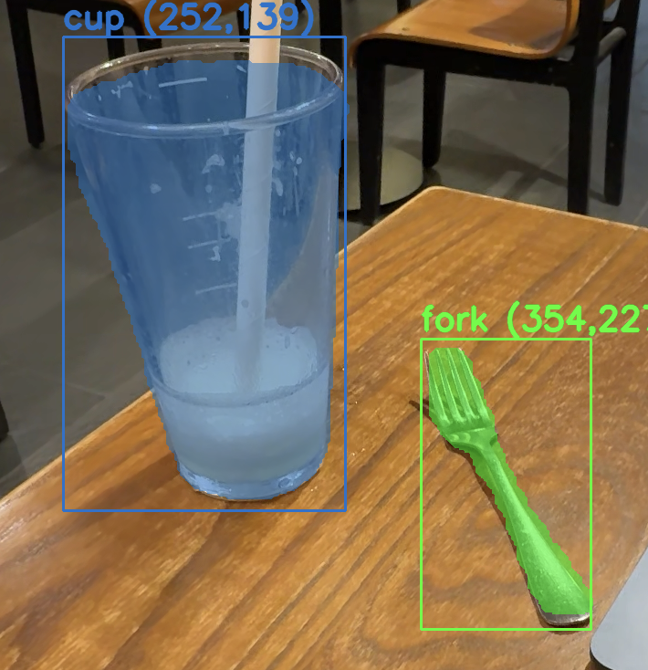
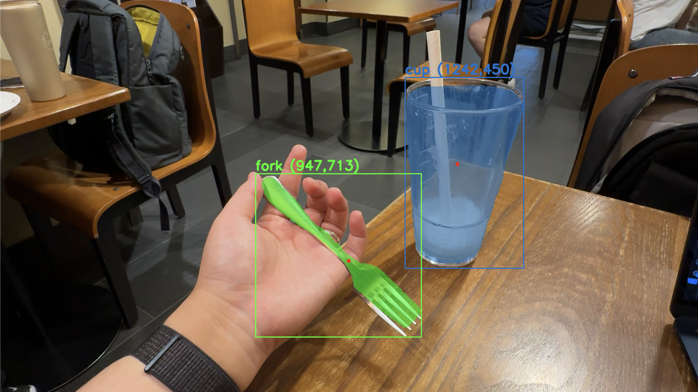

# PALCON: Pick And Locate Controller

## Table of Contents

1. [Project Overview](#project-overview)
2. [Features](#features)
3. [Installation](#installation)
4. [Usage](#usage)
5. [Architecture](#architecture)
6. [YOLO Segmentation](#yolo-segmentation)
7. [Contributing](#contributing)
8. [License](#license)
9. [Acknowledgements](#acknowledgements)
10. [Contact](#contact)

## Project Overview

PALCON (Pick And Locate Controller)는 PAL (Pick And Locate) 로봇 팔을 제어하는 소프트웨어입니다. PAL은 객체 탐지를 통해 식기를 수집하는 스칼라 로봇으로, PALCON을 통해 제어됩니다. 이 프로젝트는 컴퓨터 비전을 활용한 객체 추적 네트워크를 구현합니다.

## Features

- YOLO 기반 객체 탐지
- 로봇 팔 제어
- 실시간 객체 추적
- 다른 시스템과의 통합

## Installation

### Prerequisites

- Python 3.x
- 필요한 라이브러리 (아래 명령어로 설치 가능)

### Step-by-Step Guide

1. Repository 클론
   \`\`\`bash
   git clone https://github.com/yourusername/PALCON.git
   cd PALCON
   \`\`\`
2. 필요한 라이브러리 설치
   \`\`\`bash
   pip install -r requirements.txt
   \`\`\`
3. 환경 설정
   - 환경 변수 설정
   - YOLO 모델 다운로드 및 설정

## Usage

### Running PALCON

PALCON 소프트웨어를 실행하는 방법:
\`\`\`bash
python main.py
\`\`\`

### Examples

예제 이미지에 대한 추론 결과:

1. **Input Image**: res/fork-and-cup01.png
   

   **Output**: (예측된 객체 정보)

2. **Input Image**: res/fork-and-cup02.png
   

   **Output**: (예측된 객체 정보)

### Command Line Options

- \`--config\`: 설정 파일 경로
- \`--input\`: 입력 이미지/비디오 경로
- \`--output\`: 출력 경로

## Architecture

PALCON 소프트웨어 아키텍처:

- 주요 구성 요소
- 각 구성 요소 간의 상호작용
- 시스템 흐름 다이어그램

## YOLO Segmentation

YOLO (You Only Look Once) 세그멘테이션:

- YOLO 개요
- PALCON에서의 YOLO 통합
- 예제 구성 및 사용법

## Contributing

프로젝트 기여 방법:

- 버그 리포트 및 기능 요청 지침
- 코드 스타일 및 컨벤션
- Pull request 절차

## License

프로젝트 라이선스 정보

## Acknowledgements

- 기여자 및 서드파티 라이브러리/도구 크레딧
- 펀딩 또는 스폰서십 정보

## Contact

- 프로젝트 관리자 연락처
- 관련 리소스 또는 문서 링크
